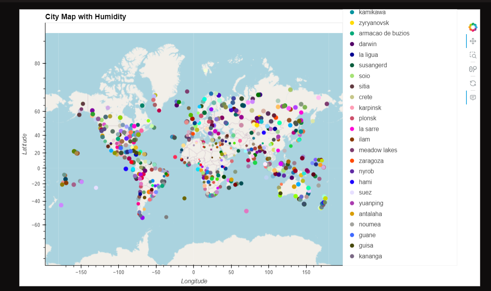
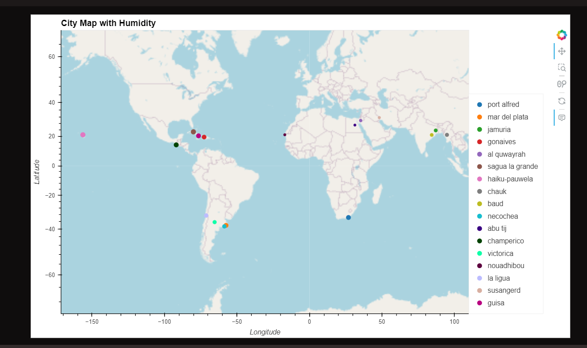

# python-api-challenge

This Python script is designed to use the OpenWeatherMap API to retrieve weather data with the aims of analyzing comparison data amongst randomly generated cities. I was able to create a series of scatter plots to showcase the following relationships: Latitude vs. Temperature, Latitude vs. Humidity, Latitude vs. Cloudiness, Latitude vs. Wind Speed. I also computed the Linear Regression using the slope of a line formula(y = mx + b) for each of these relationships with an emphasis on the r-value. Detail analysis' were given for each relationship in order to give more clarity about the correlations between each group of variables.

The second part of the analysis was geared towards planning a future vacation. I used several libraries within Python in order to accomplish my analysis.
I also made another API call from Geoapify in order to create Maps and loaded a required CSV file with the weather and coordinates data for each city created in Part 1 of my analysis in order to get a better idea and visualization of each location. I was able to narrow down hotel options by using the Geoapify API to find the first hotel located within 10,000 metres of my desired location. I also requested some JSON info/data in order to retrieve desired results.

This script also uses Pandas and Jupyter Notebook to gather and organize the data into DataFrames which are designed to run in a Python environment. The script can be tailored and utilized by any person and/or organization looking to make decision based on impactful weather data.

Source Data: 

Chat GPT Provider: OpenAI Model Version: GPT-3.5 Training Data: Diverse internet text Training Duration: Training duration was about 2-3 hours @article{openai2023, author = {OpenAI}, title = {ChatGPT: A Language Model by OpenAI}, year = {2023}, url = {https://www.openai.com}, }

Classmates

BCS app within Slack app

Stackoverflow

YouTube:
How To... Calculate Correlation Coefficients in R #79 https://www.youtube.com/watch?v=uoqHsUx6SG8&t=12s

HOW TO PARSE JSON FROM AN API: USING PYTHON https://www.youtube.com/watch?v=iaN1FxjBuGk&t=269s

 First Map rendered in Vacation_Py for viewing

 Second Map rendered in Vacation_Py for viewing
